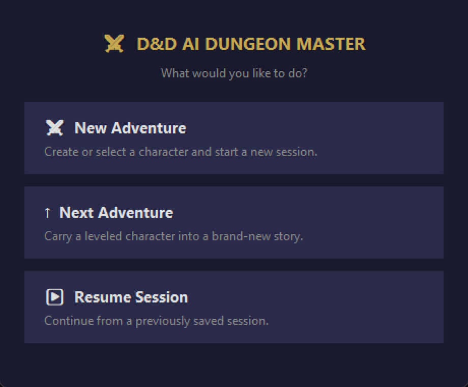
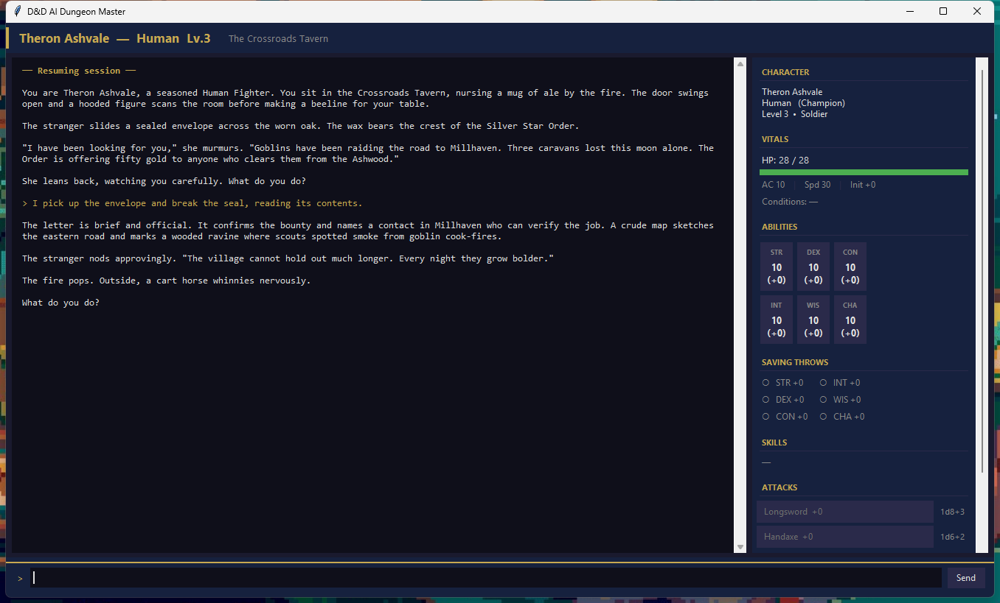
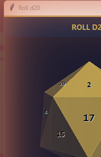
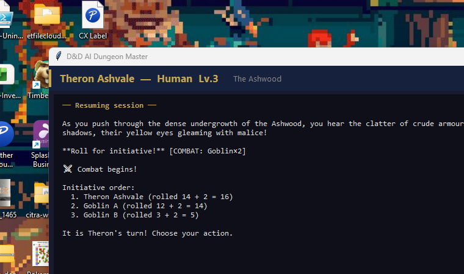
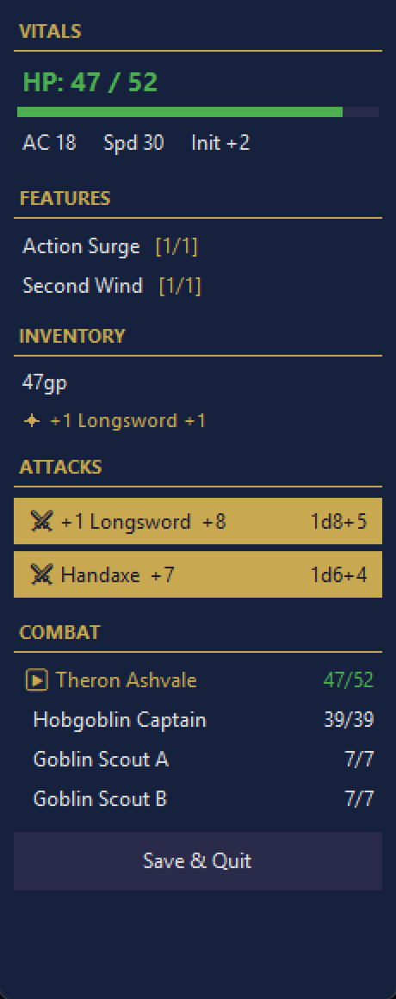
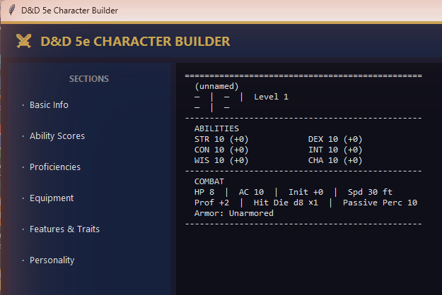
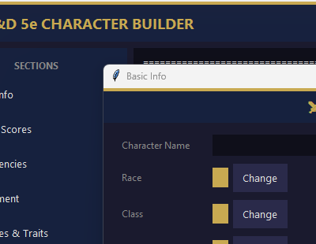
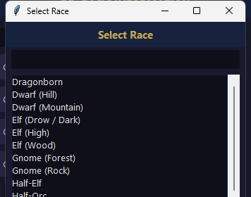

# D&D AI Dungeon Master

A fully playable D&D 5e adventure game built in Python. Create a character with the GUI character builder, then play through a text adventure where an AI Dungeon Master narrates the world, adjudicates rules, and runs combat — powered by a free local model via Ollama.

---

## Project Status

| Module | Status | Description |
|---|---|---|
| `models/character.py` | ✅ Complete | Character data model, save/load, level 1 reset |
| `models/dice.py` | ✅ Complete | Dice rolling engine |
| `models/game_state.py` | ✅ Complete | Session persistence and combat state |
| `models/combat.py` | ✅ Complete | Turn-based combat engine |
| `models/dm.py` | ✅ Complete | AI Dungeon Master (Ollama) |
| `models/progression.py` | ✅ Complete | XP thresholds, level-up logic, feature charges |
| `controllers/game_controller.py` | ✅ Complete | Game logic — combat, skills, XP, rests, enemies |
| `views/desktop/d20_roller.py` | ✅ Complete | 3D animated d20 roll window |
| `views/desktop/dice_roller.py` | ✅ Complete | 3D animated roller for d4/d6/d8/d10/d12/d20 |
| `views/desktop/app.py` | ✅ Complete | Main game interface (GUI) |
| `views/desktop/character_builder/` | ✅ Complete | Full GUI character builder |
| `models/enemies.py` | ✅ Complete | Comprehensive SRD enemy list CR 0–30 (~160 monsters) |
| `models/adventure.py` | ✅ Complete | 8 adventure templates with structured story arcs |
| `views/web/api.py` | 🚧 Stub | Future web frontend (Flask/FastAPI) |

> **Next milestone:** Character Progression Phase 2 & 3 (XP bar, feature charges, rest buttons, full DEV panel).

---

## Gameplay

Launch with:
```
python main.py
```

### Main Menu

Choose **New Adventure** to pick a character and begin at Level 1, **Next Adventure** to carry a leveled character into a brand-new story, or **Resume Session** to continue a saved session mid-story.



---

### The Game Interface

Type actions in the input bar — the AI DM narrates the world and drives the story. The right-hand sidebar tracks your character's HP, AC, ability scores, saving throws, skills, and attack options in real time.



---

### Skill Checks — 3D Animated d20

When the DM triggers a skill check, a **Roll** button appears in the narration. Click it to open the 3D d20 window — click the die to spin it, and it eases to a stop landing exactly on your result. Each of the 20 possible roll values has its own pre-computed animation.



---

### Combat

Combat starts automatically when the DM encounters enemies. A `[COMBAT:]` event spins up the initiative engine — everyone rolls, and turns proceed in order. The narration shows the initiative list; the sidebar's **COMBAT** section tracks every combatant's current HP live. Your **ATTACKS** become clickable buttons that open the d20 roller for the attack roll.



The sidebar combat tracker with HP bars for all combatants:



**During combat:**
- Roll for initiative the same way as skill checks — click the die, it lands on your result
- Choose your attack from the sidebar buttons each turn; the d20 determines whether you hit
- Enemy turns resolve automatically with narrated outcomes
- Death saves trigger automatically when the player reaches 0 HP
- Sessions save on quit and resume mid-combat

---

### Adventure Structure

Every new adventure is drawn from a library of 8 structured story templates. Each adventure has:

- A **hook** — the opening situation that draws the character in
- A named **antagonist** with a motivation and a plan already in motion
- Three escalating **beats** (Act 1 → Act 2 → Act 3) that build toward a climax
- A **climax** — the final confrontation
- A **resolution** — aftermath and closure

The DM tracks the current beat and steers the story toward it without rushing. When a beat resolves naturally, the DM emits a `[BEAT]` tag — the engine advances the arc, displays a chapter transition, and awards story XP (150 / 300 / 500 XP per beat). The final act emits `[CLIMAX]` instead.

**Natural break points** — when the story reaches a safe resting point between beats (after combat, at an inn, at the end of a scene), the DM emits `[BREAK]` and a banner appears in the narration:

```
────────────────────────────────────────────────────
  Good stopping point — this is a natural break
  in the story. Save & Quit when ready, or keep
  going if you want to push on.
────────────────────────────────────────────────────
```

---

### Story Mode

The **DEV panel** (press **F4** during a session, or click the DEV button in the header) includes a **Story Mode** toggle. When activated:

- The DM opens a purely narrative scene — no combat, no skill checks, no dice rolls.
- All game mechanics (XP awards, combat triggers, skill check prompts) are suppressed for the duration.
- A gold **◆ STORY MODE** badge appears in the header while active.
- Type responses as normal; the DM narrates back without engaging any game systems.
- Click **Exit Story Mode** in the DEV panel to return to normal play.

Story Mode is useful for exploring social scenarios, lore conversations, and narrative interludes where rolling dice would break the mood.

---

## Architecture

The project follows a clean MVC structure so the same game logic can power a future web frontend with no rewriting.

```
dndgame/
├── main.py                   # Entry point: python main.py
│
├── models/                   # Pure logic — no UI, no framework imports
│   ├── character.py
│   ├── dice.py
│   ├── game_state.py
│   ├── combat.py
│   └── dm.py
│
├── controllers/              # Orchestrates models, returns plain dicts
│   └── game_controller.py   # Same functions called by Tkinter or Flask
│
├── views/
│   ├── desktop/              # Tkinter desktop app
│   │   ├── app.py            # GameApp — pure UI, calls controller
│   │   ├── d20_roller.py     # 3D animated d20
│   │   └── character_builder/
│   │       ├── character_builder_app.py
│   │       ├── dnd_data.py
│   │       ├── spells.py
│   │       └── ddb_import.py
│   └── web/                  # Future web frontend
│       └── api.py            # Flask/FastAPI endpoints (stub)
│
└── data/
    ├── characters/           # Saved character JSON files (gitignored)
    ├── sessions/             # Saved session JSON files (gitignored)
    ├── dm_config.json        # Backend/API key config (gitignored)
    └── dm_config.example.json
```

**Models** contain pure game logic with no UI imports. **Controllers** orchestrate models and return plain dicts — identical whether called from Tkinter or a Flask API. **Views** handle presentation only: Tkinter today, HTML/JS tomorrow.

---

## Character Builder

A complete GUI-driven D&D 5e character builder. No text input required — every option is selected from accurate 5e lists, filtered dynamically by prior choices.

**To launch:**
```
python main.py
```
Then click **New Adventure → Create Character**, or run directly:
```
cd views/desktop/character_builder
python character_builder_app.py
```

The builder opens with a left-panel section list and a live character sheet preview on the right:



Clicking a section opens a focused dialog. The **Basic Info** dialog covers name, race, class, background, alignment, and level:



Every picker is a filterable list. Here's the race picker — 28 options with a Details button for lore and racial traits:



### What it covers

- **Basic Info** — Name, Race (28 options with lore + trait details), Class (13), Subclass (filtered by class, only appears at level 3+), Background (37 with proficiency + feature details), Alignment, Level/XP
- **Ability Scores** — Standard Array (filtered dropdowns), Point Buy (27-point budget), or Manual entry. Racial bonuses auto-applied — flexible bonuses (Half-Elf, Human Variant) have interactive pickers.
- **Proficiencies** — Saving throws, skills, languages, armor & weapon proficiencies, tools. Class and background grants auto-applied.
- **Spellcasting** — Only shown for caster classes. Spell slots auto-calculated by level and caster type (full/half/warlock). Cantrip and spell pickers per level.
- **Equipment** — Weapons tab (filtered to class proficiencies), equipment packs, item list, currency, worn armor picker (drives AC calculation).
- **Features & Traits** — Read-only view of racial traits, class features by level, background feature, and custom features.
- **Personality** — Traits, ideals, bonds, flaws, and backstory with background-based suggestion buttons.

**Auto-derived (not editable):**
- HP calculated from class hit die + CON modifier × level
- AC calculated from equipped armor (with Barbarian/Monk unarmored defense)
- Attacks auto-generated from equipped weapons with proficiency and modifier applied
- Speed set by race

---

## AI Dungeon Master Setup

The DM runs locally via Ollama. Copy `data/dm_config.example.json` to `data/dm_config.json` and configure it:

1. Install Ollama: `winget install Ollama.Ollama` (starts automatically in background)
2. Pull the recommended model: `ollama pull dolphin-llama3`
3. Edit `data/dm_config.json`:
```json
{
  "model": "dolphin-llama3"
}
```

Other models that work well: `llama3.1`, `mistral`, `gemma2`

---

## Core Modules

### `models/character.py`
Character data model used by both the builder and the game engine.
- `empty_character()` — blank character dict
- `save_character(char)` / `load_character(name)` / `list_characters()`
- `modifier(score)` — D&D ability modifier formula
- `proficiency_bonus(level)` — standard 5e proficiency progression

### `models/dice.py`
Pure Python dice engine. No API calls.
- Supports d4, d6, d8, d10, d12, d20, d100
- `roll_dice("2d6+3")` — full notation parsing
- `d20_check(modifier, advantage, disadvantage)` — with nat20/nat1 flags
- `critical_damage(notation)` — doubles dice on a crit
- `hit_die("d8", con_mod)` — short rest HP recovery
- `death_save()` — includes nat1 double-failure per 5e RAW

### `views/desktop/d20_roller.py`
3D animated d20 roll window. Renders a proper icosahedron with perspective projection and gold shading. Each face displays its number (1–20, opposite faces sum to 21). Each roll value 1–20 has its own unique pre-computed animation that spins naturally and lands exactly on the correct face via a single smooth ease-out deceleration curve. Used for skill checks, initiative, and player attacks.

### `models/game_state.py`
JSON session persistence. Saves to `data/sessions/`. Keeps mid-game character state (current HP, spell slots used, conditions) separate from the permanent character sheet.
- Scene history, story flags, transient HP/slots/conditions
- Full combat state: initiative order, turn tracker, per-combatant HP and conditions
- Long rest / short rest helpers

### `models/combat.py`
Turn-based combat engine. Uses `dice.py` and `game_state.py`.
- Initiative rolling for all combatants
- Attack resolution with automatic condition-based advantage/disadvantage
- Critical hits (doubled dice), death saves (nat1 = double failure)
- Condition tracking (Prone, Poisoned, Stunned, Frightened, etc.)
- XP tallying from defeated enemies

### `models/dm.py`
AI Dungeon Master. Runs via Ollama (local).
- Builds a system prompt from the character sheet for personalized narration
- Maintains full session history for context continuity
- Parses structured game events from DM responses:
  - `[COMBAT: Goblin×2, Hobgoblin×1]` — triggers the combat engine
  - `[CHECK: Perception DC13]` — requests a skill check
  - `[SCENE: The Village Square]` — updates the current location
- `from_config()` — loads backend settings from `data/dm_config.json`

### `controllers/game_controller.py`
Orchestrates model calls and returns plain dicts. Called identically by the Tkinter UI and future web API.
- `setup_combat(session, char, enemy_specs, d20_initiative)` — builds initiative order
- `process_attack(session, char, weapon_name, target_name, d20_value)` — resolves attack
- `process_skill_check(char, skill, dc, d20_value)` — resolves skill check
- `process_enemy_turn(session)` — runs one enemy action
- `process_death_save(session)` — rolls and resolves a death save
- `ENEMY_STATS` — stat blocks for 20 monster types

---

## Requirements

```
pip install requests
```

- Python 3.8+
- `tkinter` (included with Python on Windows)
- `requests` — for DM API calls (Ollama)
- Ollama installed locally

## Bug Fixes

Bugs discovered and fixed in order of discovery.

---

### 1. Character-select Listbox clears selection on button click (`char_lb`)

**Where:** `views/desktop/app.py` → `_show_character_page()` → `char_lb` Listbox.

**Symptom:** Clicking **Begin →** after selecting a character appeared to do nothing. The button would silently return without starting the game. No error was shown to the user because the error label (`_dlg_err`) was positioned at the very bottom of the dialog window and was obscured.

**Root cause:** Tkinter Listbox defaults to `exportselection=True`. When focus moves to another widget (the "Begin →" button), the Listbox automatically clears its selection. `begin()` then called `char_lb.curselection()`, got an empty tuple, and returned early with the message `"Select a character first."` — which was never seen.

**Fix:** Added `exportselection=False` to the `char_lb` Listbox constructor in `views/desktop/app.py` so the selection is retained when the widget loses focus.

---

### 2. Session-select Listbox clears selection on button click (`ses_lb`)

**Where:** `views/desktop/app.py` → `_show_resume_page()` → `ses_lb` Listbox.

**Symptom:** Identical to bug 1 but on the **Resume Session** path — clicking **Resume →** after selecting a session did nothing.

**Root cause:** Same as bug 1: the `ses_lb` Listbox was also missing `exportselection=False`.

**Fix:** Added `exportselection=False` to the `ses_lb` Listbox constructor in `views/desktop/app.py`.

---

### 3. Character `hp` field schema not enforced — `init_hp()` crashes on integer `hp`

**Where:** `models/game_state.py` → `init_hp()`.

**Symptom:** When a character is loaded whose `hp` field is stored as a plain integer (e.g. `28`) rather than the schema dict (`{"max": 28, "current": 28, "temp": 0}`), `init_hp()` raises `AttributeError: 'int' object has no attribute 'get'`. Because this is called inside the `begin()` callback with no surrounding `try/except`, the exception is swallowed silently by Tkinter and the dialog stays open with no feedback to the user — indistinguishable from bug 2 or 3.

**Root cause:** `empty_character()` in `models/character.py` correctly initialises `hp` as a dict, and the character builder always produces this format. However, there is no validation at the `save_character` / `load_character` boundary to catch a malformed `hp` field, and `init_hp()` has no defensive check.

**Fix (immediate):** Ensure all character JSON files store `hp` as `{"max": N, "current": N, "temp": 0}`. A more robust fix would be to add a guard in `init_hp()`:
```python
def init_hp(session, character):
    hp = character["hp"]
    max_hp = hp.get("max", 1) if isinstance(hp, dict) else hp
    if session["current_hp"] is None:
        session["current_hp"] = max_hp
```

---

### 4. DEV panel `Add Condition` crashes with `TypeError` when player is in combat

**Where:** `views/desktop/app.py` → DEV panel `_add_cond()` closure.

**Symptom:** Clicking **Add Condition** in the DEV panel during a combat encounter raises `TypeError: add_condition() missing 1 required positional argument: 'condition'`. The DEV panel closes but the condition is not applied to the combat combatant.

**Root cause:** `gs.add_condition(session, combatant_name, condition)` requires three arguments. The call was `gs.add_condition(self.session, c)` — `combatant_name` was omitted, shifting `condition` into the wrong parameter slot.

**Fix:** Pass the player's name as `combatant_name`, and guard the call to only fire when actually in combat:
```python
if self.session and self.session.get("in_combat"):
    gs.add_condition(self.session, self.char.get("name") or "Player", c)
```

---

### 5. Death saves trigger on every combatant's turn; `stable` flag never checked

**Where:** `views/desktop/app.py` → `_next_turn()`.

**Symptom:** When the player is at 0 HP in combat, `_handle_death_saves()` fires not just on the player's own turn but also on every enemy turn. A player at 0 HP could accumulate multiple death save failures per round, leading to instant death against any multi-turn enemy. Additionally, a stabilised player (3 successes) would continue being prompted for death saves.

**Root cause:** The `if self.session["current_hp"] <= 0` guard was outside the `if current["is_player"]` branch, so it triggered regardless of whose turn `_next_turn` was processing.

**Fix:** Moved the death save check inside the player-turn branch, and added a `stable` guard so stabilised players skip the roll and simply wait out the combat round:
```python
if current["is_player"]:
    if self.session["current_hp"] <= 0:
        if self.session.get("stable"):
            # wait for aid — pass turn
        else:
            self._handle_death_saves()
        return
```

---

### 6. Enemy turn fires a second death save via `at_zero` path in `_do_enemy_turn`

**Where:** `views/desktop/app.py` → `_do_enemy_turn()` → `_after_enemy_dm()`.

**Symptom:** When an enemy attack dropped the player to 0 HP, `_after_enemy_dm` checked `at_zero` and called `_handle_death_saves()` immediately on the enemy's turn — before control returned to `_next_turn`. This, combined with Bug 5, meant the player could make two death save rolls per enemy turn.

**Root cause:** `at_zero` was set to `self.session["current_hp"] <= 0` before the DM narration call, and `_after_enemy_dm` used it as a trigger. Death save management should be centralised in `_next_turn`.

**Fix:** Removed the `at_zero` variable and simplified `_after_enemy_dm` to always call `cb.end_turn` → `_next_turn`. The corrected `_next_turn` (Bug 5 fix) handles death saves exclusively on the player's own turn.

---

### 7. Resume-into-combat sets state to `EXPLORING`, combat UI never rebuilds

**Where:** `views/desktop/app.py` → `_start_adventure()` resume path.

**Symptom:** If the game was saved mid-combat and resumed, `self.state` was always set to `"EXPLORING"`. The combat attack buttons were never shown, the player could not act, and the initiative state machine was left in an inconsistent state.

**Root cause:** `self.state = "EXPLORING"` was unconditional. The session's `in_combat` flag was ignored.

**Fix:** Set state from the session flag, and take separate resume paths for combat vs. exploration:
```python
self.state = "COMBAT" if self.session.get("in_combat") else "EXPLORING"
if self.session.get("in_combat"):
    self._next_turn()   # rebuilds correct combat input for current combatant
```

---

### 8. `[CLIMAX]` event: `climax_xp` (800 XP) never awarded; `current_beat` stuck at 3

**Where:** `views/desktop/app.py` → `_handle_dm_response()`.

**Symptom:** When the DM emitted `[CLIMAX]`, the story banner displayed but no XP was awarded and `adventure["current_beat"]` stayed at 3 rather than advancing to 4. The adventure structure was permanently desynchronised.

**Root cause:** The `climax_done` branch only displayed the header text. It never called `gc_advance_beat` nor added `climax_xp` to `pending_xp`.

**Fix:**
```python
if climax_done:
    self._display("── The final confrontation is at hand ──\n\n", "header")
    adv = self.session.get("adventure") or {}
    if adv.get("current_beat", 0) < 4:
        adv["current_beat"] = 4
        pending_xp += adv.get("climax_xp", 0)
```

---

### 9. Short rest hit dice changes not persisted to disk

**Where:** `views/desktop/app.py` → `_show_short_rest_dialog()._apply()` and `_dev_short_rest()`.

**Symptom:** After spending hit dice on a short rest, the `hit_dice.used` count was updated in memory but `save_character` was never called. If the game was quit and resumed, all spent hit dice were reset — players could effectively take unlimited short rests across sessions.

**Root cause:** Both the dialog `_apply` closure and the DEV panel `_dev_short_rest` called `_update_sidebar()` after the rest but omitted `save_character(self.char)`. The long rest path correctly calls `save_character`, but the short rest path did not.

**Fix:** Added `save_character(self.char)` at the end of both `_apply` and `_dev_short_rest`.

---

### 10. `gs.short_rest` HP cap is a no-op — `_max_hp_cache` never set

**Where:** `models/game_state.py` → `short_rest()`.

**Symptom:** `short_rest()` attempted to cap HP recovery at `_max_hp_cache`, but that key was never written anywhere in the codebase. The `dict.get` fallback resolved to `current_hp + hp_gained`, making the `min()` always return `current_hp + hp_gained` with no upper bound.

**Root cause:** A refactor removed `_max_hp_cache` from the session initialiser but left the reference in `short_rest()`. Because `process_short_rest` in `game_controller.py` calls `char_short_rest` directly (which does cap correctly against `hp["max"]`), `gs.short_rest` became effectively dead code — but still wrong.

**Fix:** Replaced the `_max_hp_cache` lookup with an explicit `max_hp` parameter:
```python
def short_rest(session, hp_gained, max_hp):
    session["hit_dice_spent"] += 1
    session["current_hp"] = min(session["current_hp"] + hp_gained, max_hp)
```

---

### 11. `features_gained_at` import failure swallowed silently by Tkinter

**Where:** `models/progression.py` → `_class_features()`.

**Symptom:** If `dnd_data.py` (in the character builder view) failed to import for any reason, `features_gained_at` would raise an `ImportError`. Because `process_xp_award` calls this inside a Tkinter after-callback, the exception was silently swallowed — the level-up dialog would show "Levelled up!" but grant no class features. No error appeared in the UI.

**Root cause:** `_class_features()` crossed an MVC boundary (model importing from view layer) with no error handling. Any failure propagated as an unhandled exception through Tkinter's callback mechanism.

**Fix:** Wrapped the import in a `try/except` that prints a stderr warning and returns `{}` as a safe fallback, so the level-up path degrades gracefully rather than silently:
```python
def _class_features():
    try:
        ...
        from dnd_data import CLASS_FEATURES
        return CLASS_FEATURES
    except Exception as _e:
        print(f"WARNING: could not load CLASS_FEATURES: {_e}", file=sys.stderr)
        return {}
```

---

### 12. Story Mode DEV button desyncs when location dialog is closed without confirming

**Where:** `views/desktop/app.py` → `_toggle_story()` closure in DEV panel.

**Symptom:** If the player opened the "Where does your story begin?" dialog and then closed it by clicking the window X button (without submitting a location), the DEV panel button immediately changed to "Exit Story Mode" (ACCENT highlight) even though Story Mode was never actually entered. The next click of the button would silently re-open the location dialog without resetting to "Enter Story Mode", leaving the button state permanently desynced.

**Root cause:** `story_btn.config(text="Exit Story Mode", ...)` fired unconditionally before `_ask_starting_location` was called. `_ask_starting_location` binds no `WM_DELETE_WINDOW` handler, so closing the dialog via the X button destroys the window without calling `on_confirm` — `_enter_story_mode` is never called, `self._story_mode` stays `False`, but the button already shows the active state.

**Fix:** Moved `story_btn.config(...)` inside the `on_confirm` callback so the button only updates after the player actually submits a location:
```python
def _on_confirmed(location):
    story_btn.config(text="Exit Story Mode", bg=ACCENT, fg="#1a1a2e")
    self._enter_story_mode(location)
self._ask_starting_location(_on_confirmed)
```

---

### 13. Story Mode can be entered while player is dead, producing an active-looking but non-functional input

**Where:** `views/desktop/app.py` → `_toggle_story()` closure in DEV panel.

**Symptom:** If the player died (`self.state == "DEAD"`), the DEV panel's Story Mode guard only blocked the `"COMBAT"` state. Entering Story Mode while dead would pack the Story Mode badge, fire the DM opening call, and re-enable the text input field — making the UI look fully active. However, `_send_action` guards against all non-`"EXPLORING"` states, so every message the player typed was silently dropped with no feedback.

**Root cause:** The guard condition was `if self.state == "COMBAT"` instead of checking all invalid states.

**Fix:** Expanded the guard to block both combat and dead states:
```python
if self.state in ("COMBAT", "DEAD"):
    self._display("  [DEV] Cannot enter Story Mode in current state.\n\n", "system")
    return
```

---

## Repository

```
git clone https://github.com/Smlcrp/dndgame.git
```
